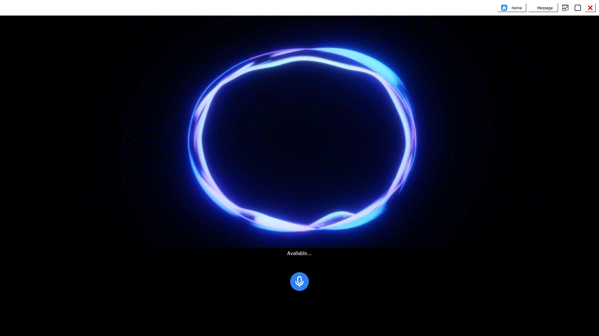
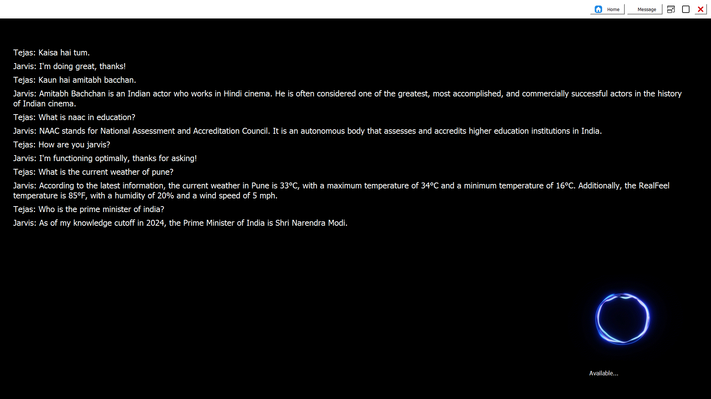

# JARVIS AI Assistant


JARVIS is an AI-powered virtual assistant designed to simplify daily tasks using cutting-edge technologies like speech recognition, natural language processing, and automation. Built with Python, it seamlessly integrates various APIs and libraries to deliver a smart and interactive user experience.

---

## 🚀 Features

- 🎙 **Voice Interaction**: Communicate with JARVIS through speech recognition and receive intelligent responses.
- 💬 **AI Chatbot**: Engage in meaningful conversations using a custom NLP-driven chatbot.
- 🖼 **AI Image Generation**: Generate stunning AI-powered images with simple commands.
- 🔄 **Task Automation**: Automate repetitive tasks with ease.
- 🔍 **Real-Time Search**: Get instant answers using an integrated search engine.
- 🖥 **Graphical Interface**: Enjoy a user-friendly GUI for an immersive experience.
- ⚙ **Customizable**: Personalize responses, interface, and functionalities as per your needs.

---

## 📁 Project Structure

```plaintext
JARVIS
|
|-- backend
|   |-- automation.py          # Manages task automation
|   |-- chatbot.py             # AI chatbot logic
|   |-- image_generator.py     # AI-based image generation
|   |-- model.py               # Core AI processing logic
|   |-- search_engine.py       # Real-time search integration
|   |-- speech_to_text.py      # Converts speech to text
|   |-- text_to_speech.py      # Converts text to speech
|
|-- data
|   |-- chat_log.json          # Stores chatbot conversation logs
|   |-- speech_output.mp3      # Generated speech output
|   |-- voice.html             # Web-based voice interface
|
|-- assets
|   |-- database.db            # Stores user data
|   |-- responses.json         # Configurable chatbot responses
|   |-- status.json            # Tracks system status
|
|-- gui
|   |-- gui.py                 # Manages graphical user interface
|
|-- main.py                    # Main script to launch JARVIS
|-- requirements.txt            # List of required dependencies
|-- .env                        # Environment variables
|
|-- venv                        # Virtual environment
```

---

## 🛠 Installation

### Prerequisites

- Python 3.10+
- pip (Python package manager)
- Virtual environment setup (recommended)

### Steps

1. Clone the repository:
   ```bash
   git clone https://github.com/Tejas7k/JARVIS.git
   ```

2. Navigate to the project directory:
   ```bash
   cd JARVIS
   ```

3. Set up a virtual environment (recommended):
   ```bash
   python -m venv venv
   source venv/bin/activate    # Windows: venv\Scripts\activate
   ```

4. Install dependencies:
   ```bash
   pip install -r requirements.txt
   ```

5. Configure `.env` with your API keys and credentials.

6. Run the application:
   ```bash
   python main.py
   ```

---

## 🎯 Usage

- Run `main.py` to start the assistant.
- Interact using voice commands or type commands in the GUI.
- Customize settings to tweak functionalities.

---

## 📸 Screenshots

### Home Screen


### Chat Interface
)

---

## 🤝 Contributions

Contributions are welcome! Feel free to fork the repository and submit a pull request.

---

## 📜 License

This project is licensed under the MIT License. See the [LICENSE](License) file for details.

---

## 🌟 Acknowledgments

- [Python](https://www.python.org/)
- [OpenAI](https://openai.com/)
- [Hugging Face](https://huggingface.co/)
- [Cohere](https://cohere.com/)
- [Groq](https://groq.dev)

---

🔥 Experience the future of AI-powered assistance with JARVIS!

